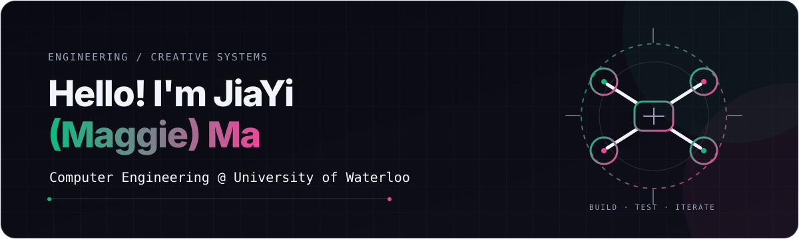

### About Me

I'm a Computer Engineering student at the University of Waterloo. I like connecting embedded hardware, robotics, AI, and thoughtful interfaces into systems people can actually use.

### What I'm Working On 

I'm exploring robotics simulation and hardware–software integration, while continuing to build **[The Thirteenth Chime](https://maggiemajiayi-cell.github.io/the-thirteenth-chime/clockwork/)**, a browser-based escape room.

### TechStack

- **Languages:** C, C++, Python, JavaScript, SQL, Verilog
- **Embedded & robotics:** ESP32, Arduino, ROS, AirSim, sensor integration
- **Web & AI:** React, Next.js, Gemini AI, OpenHex, computer vision
- **Tools:** Git, Unreal Engine, Godot, KiCad

### Selected Work

- **[UAV research](https://www.youtube.com/watch?v=MFlh8-qheTQ)** — Built a virtual–real testing platform at Tongji University, connecting AirSim and Unreal Engine simulations with ROS and motion capture for autonomous navigation research.
- **[Tongzhou mini program](https://maggiemajiayi-cell.github.io/portfolio/#projects)** — Structured alumni records with SQL and refined OpenHex agents for lookup, summaries, and service recommendations.
- **[Eight For Long](https://maggieeeeem.itch.io/eight-for-long)** — Shipped an underwater room escape game in 96 hours for GMTK Game Jam 2026; every interaction spends part of an eight-minute countdown. [Code](https://github.com/NPC-No-1/Eight-Minutes)
- **[Sprout](https://maggiemajiayi-cell.github.io/Sprout_voice_input_AItraining/)** — Built a voice-first English learning companion for newcomers and refugees using real-time speech processing and Gemini AI. [Code](https://github.com/maggiemajiayi-cell/Sprout_voice_input_AItraining)

### Links

[Portfolio](https://maggiemajiayi-cell.github.io/portfolio/) · [GitHub](https://github.com/maggiemajiayi-cell) · [LinkedIn](https://www.linkedin.com/in/jiayi-ma-795600262/) · [Email](mailto:m286ma@uwaterloo.ca)
